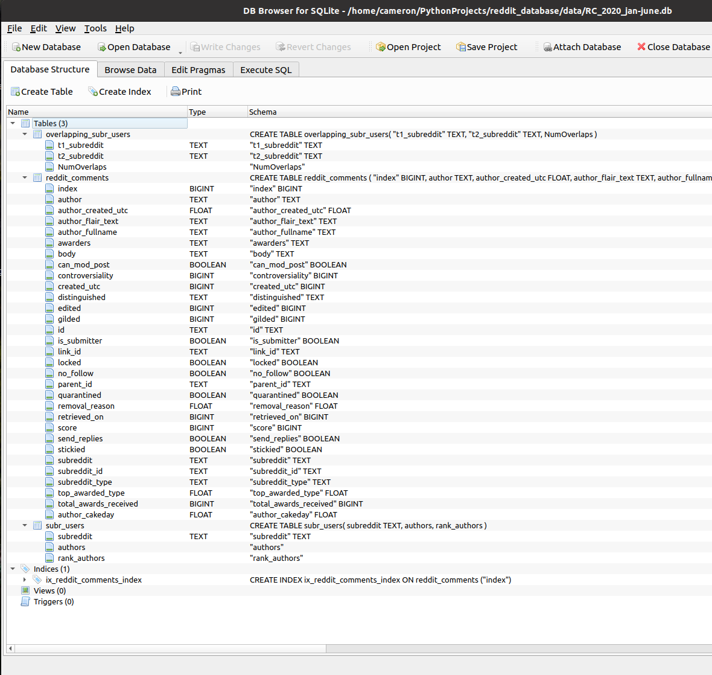

# Reddit Comment Database


The repo demonstrates how to extract massive amounts of reddit data from `.json` files, and store them in a SQL database.
- Data is extracted from https://files.pushshift.io/reddit/comments/
- Files are around 2-10 times larger when uncompressed, so we need a lot of free storage space
- Uncompressed files must be renamed to have `.json` file extension

The code is very unoptimized, but easy to understand. In hindsight it might have made more sense to set up a [local Postgres server](https://www.learndatasci.com/tutorials/using-databases-python-postgres-sqlalchemy-and-alembic/) instead of using SQLite. 

We can use the DB Browser for SQLite app to explore the database and execute SQL queries. 



### Downloading the Comment Archives

Use the notebook `download_files.ipynb` to download all of the comment archive files. 

Once downloaded, put the `.zst` files in a directory and use the following terminal command (rename filepath as needed):

```
for FILE in *; do zstd -d --memory=2048MB $FILE -o "/media/cameron/Seagate Basic/datasets/reddit/archives_uncompressed/$FILE"; done;
```

Then we can rename all the files at once using the command:

```
for filename in `ls *.zst`; do mv -- "$filename" "$(basename -- "$filename" .zst).json"; done;
```

### Building the Database

The notebook `database_build.ipynb` uses pure python to extract the comment data from the `.json` files and build a SQLite database. Since the `.json` files are too large to fit in memory, we need to divide them into chunks (smaller, temporary `.json` files) when performing the read/write operations. Pandas is used to load these temporary `.json` files into memory, where we drop unnecessay columns and write to the SQLite database. 

### Exploring the Data

One way we can explore this data is to follow Leland McInnes' fantastic tutorial [here](https://github.com/lmcinnes/subreddit_mapping/blob/master/Subreddit%20Mapping%20and%20Analysis.ipynb) to build and analyze a map of the 10,000 most popular subreddits. 

The notebook `subreddit_overlap_data.ipynb` demonstrates how to extract data of overlapping authors among subreddit communities. The result is a dataframe with hundreds of millions of rows, where each row contains a "from" subreddit, a "to" subreddit, and the number of unique commenters that the two subreddits have in common. This is later used to obtain a means of measuring the similarity bewteen any given pair of subreddits. 

The notebook `subreddit_mapping.ipynb` uses the overlap data to build an interactive map of Reddit. Some powerful data science tools are employed here in order to encode the overlap data into a useful representation for plotting. 

First, a sparse matrix is created where the rows and columns are both indexed by subreddits, and the entry position (i,j) is the number of overlaps between the $i^{th}$ and $j&{th}$ subreddit. Each row of the matrix is a vector of information describing a subreddit in terms of its relation to other subreddits. After row-normalizing the matrix, we can then get the similarity between subreddits by computing the distance between row vectors in high-dimensional space. The full-sized matrix is too large to worth with, so linear dimensionality reduction is done to compress the matrix down to a 500 dimensional representation. 

An algorithm is then needed that can convert these subreddit vectors into a 2D map, where (x,y) coordinate pairs encode the relative distance between subreddits. While a non-linear dimensionality reduction technique like t-SNE seems like a good fit for this problem, the computational cost poses problems for datasets as large as ours. An algorithm called LargeVis is used instead, which uses some clever tricks to get a more computationally effecient approach. In fact, from my experiments it actually gives much better results than t-SNE. 

Finally, Bokeh is used to visualize our subreddit map. 


### Analyzing Clusters

#### r/hardware


#### r/JoeRogan


